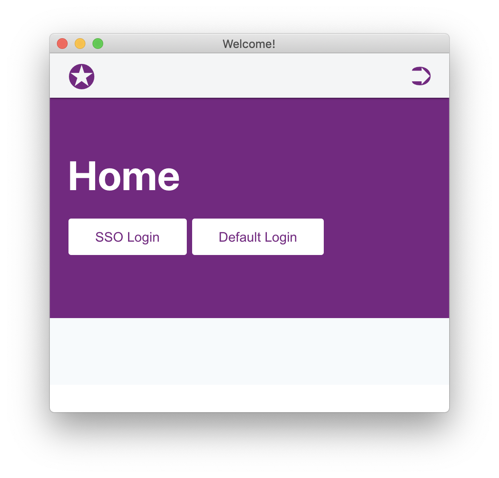

<div align="center">
    <h1 style="font-weight: bolder; margin-top: 0px" class="opacity-75">SSOmoc</h1>
    <h3 class="opacity-50">Single-Sign-On + Mocked Oauth2</h3>
</div>

<div align="center">
  <!-- 
  <h3>A pragmatic CSS for Minimalist</h3> -->
  <p>ssomoc implements both classic authentication with <strong>login form</strong> and <strong>sso authentication</strong> via oauth2-mock-api</p>

  <p>
    <a href="#">
      
    </a>
    <a href="#">
      
    </a>
  </p>
</div>

---

A Proof-of-concept of Single-Sign-On(SSO) in a standard Symfony 5 application with php 8.



## Start the containers

```
git clone https://github.com/vikbert/ssomoc.git
cd ssomoc
docker-compose up -d
```

## Compose Install

```bash
docker-compose exec php composer install
docker-compose exec php bin/console doctrine:database:create --if-not-exists -n
docker-compose exec php bin/console doctrine:migrations:migrate -n
```

## Localhost

add `ssomoc.localhost` to `/etc/hosts`, then go to [http://ssomoc.localhost](http://ssomoc.localhost)

## Authentication

### Option 1:

classic login form

### Option 2:

sso via oauth2 (mock API)

## Routing

```bash
➜ docker-compose exec php bin/console debug:router
 ------------------- -------- -------- ------ --------------------------
  Name                Method   Scheme   Host   Path
 ------------------- -------- -------- ------ --------------------------
  
  api_mock_authz      GET      ANY      ANY    /api/oauth/mock/authz
  api_mock_token      POST     ANY      ANY    /api/oauth/mock/token
  api_mock_userinfo   GET      ANY      ANY    /api/oauth/mock/userinfo

  app_home            ANY      ANY      ANY    /
  app_profile         GET      ANY      ANY    /profile
  app_login           ANY      ANY      ANY    /login
  app_logout          ANY      ANY      ANY    /logout

  api_sso_check       GET      ANY      ANY    /api/sso/check
  api_sso_info        GET      ANY      ANY    /api/sso/info
  api_sso_login       POST     ANY      ANY    /api/sso/login
 ------------------- -------- -------- ------ --------------------------
```

## licence

MIT @vikbert
