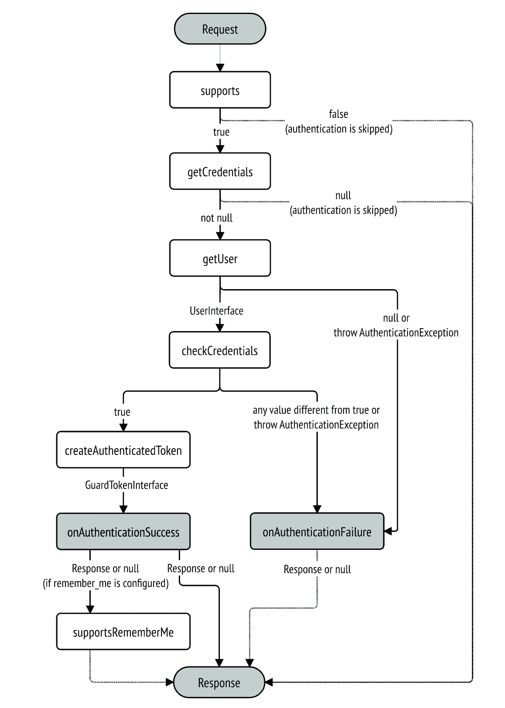

<div align="center">
    <h1 style="font-weight: bolder; margin-top: 0px" class="opacity-75">SSOmoc</h1>
    <h3 class="opacity-50">SSO + Mocked Oauth2</h3>
</div>

<div align="center">
  <p>SSOmoc demonstrates the most commonly used authentications in `symfony 5` project, such as <code>login form</code>, <code>token authentication</code>, <code>sso via oauth2-mock-api</code>.</p>

  <p>
    <a href="#">
      
    </a>
    <a href="#">
      
    </a>
  </p>
</div>

---


## Starting started

```
git clone https://github.com/vikbert/ssomoc.git
cd ssomoc

docker-compose up -d
docker-compose exec php composer install
docker-compose exec php bin/console doctrine:database:create --if-not-exists -n
docker-compose exec php bin/console doctrine:migrations:migrate -n
```

## Localhost URL

add `ssomoc.localhost` to `/etc/hosts`, then go to [http://ssomoc.localhost](http://ssomoc.localhost)

## Authentication
there are serveral options to authenticate the client in this demo project.
- login `form`
- X-AUTH-TOKEN via `token`
- sso via `Mocked oauth2`
- sso via `GitHub Oauth2`

See the details in `LoginFormAuthenticator`, `Oauth2Authenticator`, `TokenAuthenticator`, `GithubAuthenticator` in `src/Security` and the guard configuration in `security.yaml`



### Option 1: 
> authentication via `login form`

classic login form with `email` and `password`: go to `http://ssomoc.localhost/login` and do login with `email` and `password`.

```bash
 # see the credentials in security.aml
 user: ssomoc@mail.com
 pass: ssomoc 
```


### Option 2: 
> authentication via `sso oauth2`

sso via oauth2 (mock API): on the homepage, click on the button `SSO Login`


### Option 3: 
> authentication via `X-AUTH-TOKEN`

It can be tested in curl or in REST client. The `X-AUTH-TOKEN` will be persisted in browser cookie under the name `authToken`, after a successful `sso-login` or `default login`.

```bash
curl -i -X GET \
   -H "X-AUTH-TOKEN:3e5a75e5-c3c1-4e56-9ad5-65657f1afb9c" \
 'http://ssomoc.localhost/api/todos' 
```
### Option 4: 
> authentication vai `GitHub Oauth2`

you need create the `Oauth2 app` in the github account to get the `clientID` and `clientSecret`. 

To do this, go to `github.com` and select `setting` => `developer settings` => `OAuth Apps` => `New OAuth App`.


Then add the generated client ID and client secret to a new file named `.env.local` to overwrite the existing dummy `SSO_CLIENT_ID` and `SSO_CLIENT_SECRET` in `.env`. 

For example:

```
// .env.local

###> Oauth API ###
SSO_BASE_AUTHORIZATION_URL=http://ssomoc.localhost/api/oauth/mock/authz
SSO_BASE_ACCESS_TOKEN_URL=http://nginx/api/oauth/mock/token
SSO_RESOURCE_OWNER_DETAILS_URL=http://nginx/api/oauth/mock/userinfo
SSO_CLIENT_ID=my_client_id
SSO_CLIENT_SECRET=my_client_secret
###< symfony/framework-bundle ###

###> Oauth API: github ###
SSO_CLIENT_ID=e5243e172*****
SSO_CLIENT_SECRET=82496bbd41************
###< symfony/framework-bundle ### 
```

## Routing

```bash
➜ docker-compose exec php bin/console debug:router
 ------------------- -------- -------- ------ --------------------------
  Name                Method   Scheme   Host   Path
 ------------------- -------- -------- ------ --------------------------
  api_mock_authz      GET      ANY      ANY    /api/oauth/mock/authz
  api_mock_token      POST     ANY      ANY    /api/oauth/mock/token
  api_mock_userinfo   GET      ANY      ANY    /api/oauth/mock/userinfo

  api_sso_check       GET      ANY      ANY    /api/sso/check
  api_sso_info        GET      ANY      ANY    /api/sso/info
  api_sso_login       POST     ANY      ANY    /api/sso/login

  api_github_connect  GET      ANY      ANY    /api/github/connect
  api_github_check    GET      ANY      ANY    /api/github/check

  api_todos           GET      ANY      ANY    /api/todos

  app_home            ANY      ANY      ANY    /
  app_profile         GET      ANY      ANY    /profile
  app_login           ANY      ANY      ANY    /login
  app_logout          ANY      ANY      ANY    /logout
 ------------------- -------- -------- ------ --------------------------
```

#### api_mock_*
> there are 3x mocked APIs as the replacement of the classic oauth2 REST API

#### api_sso_*
> To make the sso possible in a PHP or SPA or mobile APP, there are 3x utility APIs to construct the SSO authorization-code-flow.

#### api_*
> the dummy restful resource API, which is authenticated with additional header `X-AUTH-TOKEN`

#### app_*
> they are the standard symfony application routes

#### api_github_*
> sso connection via Oauth2 API `GitHub Oauth2`


## E2E Tests
`login via form`, `login via sso` are tested by cypressE2E tests. To start the tests:
```bash
docker-compose up -d # be sure that `http://ssomoc.localhost` is reachable.
npm install
make test
# or
node_modules/cypress/bin/cypress run --spec 'cypress/integration/login_*.spec.js'
```
Tests results:
```bash
       Spec                                              Tests  Passing  Failing  Pending  Skipped
  ┌────────────────────────────────────────────────────────────────────────────────────────────────┐
  │ ✔  login_form.spec.js                       00:04        1        1        -        -        - │
  ├────────────────────────────────────────────────────────────────────────────────────────────────┤
  │ ✔  login_sso.spec.js                        00:04        1        1        -        -        - │
  └────────────────────────────────────────────────────────────────────────────────────────────────┘
    ✔  All specs passed!                        00:09        2        2        -        -        -
```


## licence

MIT [@vikbert](https://vikbert.github.io/)
