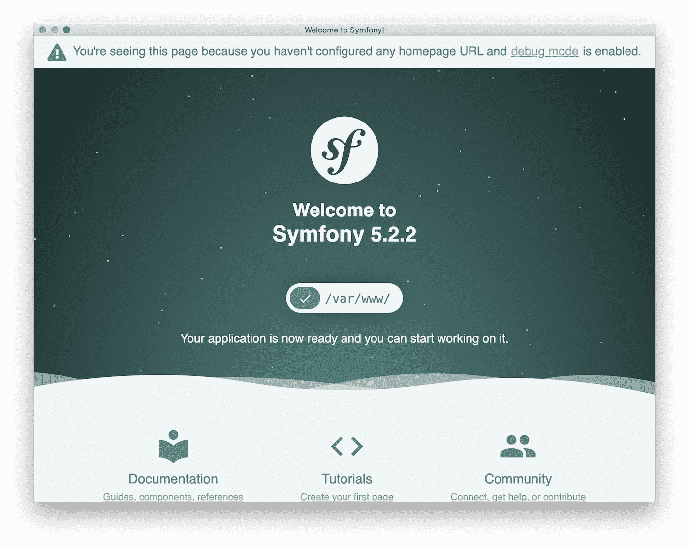

<div align="center">
    <h1 style="font-weight: bolder; margin-top: 0px" class="opacity-75">My  Docker Starter</h1>
    <h3 class="opacity-50">dockerized Symfony5, PHP 8, PostgreSQL 13</h3>
</div>

<div align="center">
  <p>
    <a href="#">
      
    </a>
    <a href="#">
      
    </a>
  </p>
</div>

---



| service | version |
| -- | -- |
| symfony | 5 |
| php | 8.0.1 |
| PostgreSQL | 13.0.1 |

```bash
➜ dps
CONTAINER ID   IMAGE               COMMAND                  PORTS                                      NAMES
19750f5406e8   base-nginx:latest   "/docker-entrypoint.…"   0.0.0.0:80->80/tcp, 0.0.0.0:443->443/tcp   symfony-docker-starter_nginx_1
ec4830a5f74e   base-php:latest     "docker-php-entrypoi…"   9000/tcp                                   symfony-docker-starter_php_1
42ab8a62da84   base-db:latest      "docker-entrypoint.s…"   0.0.0.0:2345->5432/tcp                     symfony-docker-starter_db_1 
```


## Starting started

```
git clone https://github.com/vikbert/symfony-docker-starter.git
cd symfony-docker-starter

docker-compose up -d
symfony new app
cp .env.local app/
```

Command **symfony** can be installed with this command
```bash
curl -sS https://get.symfony.com/cli/installer | bash
```

## Open App
```bash
http://localhost 
```


## licence

MIT [@vikbert](https://vikbert.github.io/)
